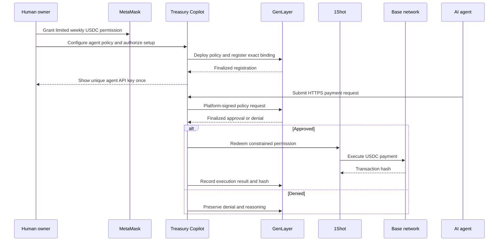

# Treasury Copilot

<p align="center">
  
</p>

<p align="center">
  <strong>Policy-controlled spending infrastructure for autonomous agents.</strong>
</p>

Treasury Copilot gives an AI agent useful spending power without giving the
agent a wallet private key or unrestricted access to human funds.

A human owner connects MetaMask, grants a limited USDC spending permission,
and creates an isolated treasury policy for one agent. The agent then requests
payments through a normal HTTPS API. Treasury Copilot submits the request to
GenLayer, waits for a finalized policy decision, and uses 1Shot to execute only
approved payments.

The result is similar to giving an employee a company card with strict limits
instead of giving them the company's bank credentials.

- Live application: [treasury-copilot-genjury.vercel.app](https://treasury-copilot-genjury.vercel.app)
- Agent documentation: [docs/api.md](docs/api.md)
- Deployment guide: [docs/deployment.md](docs/deployment.md)
- In-app documentation: [treasury-copilot-genjury.vercel.app/docs](https://treasury-copilot-genjury.vercel.app/docs)

## Contents

- [Why Treasury Copilot Exists](#why-treasury-copilot-exists)
- [Short Pitch](#short-pitch)
- [Current Release](#current-release)
- [System Overview](#system-overview)
- [Components](#components)
- [End-to-End Owner Setup](#end-to-end-owner-setup)
- [End-to-End Agent Request](#end-to-end-agent-request)
- [Agent API Quickstart](#agent-api-quickstart)
- [Trust and Security Model](#trust-and-security-model)
- [Supported Networks](#supported-networks)
- [Technology Stack](#technology-stack)
- [Local Development](#local-development)
- [Validation and Tests](#validation-and-tests)
- [Production Deployment](#production-deployment)
- [Verified Live Behavior](#verified-live-behavior)
- [Known Limitations](#known-limitations)
- [Troubleshooting](#troubleshooting)
- [Documentation](#documentation)

## Why Treasury Copilot Exists

Autonomous agents increasingly need to pay for APIs, software subscriptions,
cloud infrastructure, data, contractors, and other operational resources.
Giving an agent a fully funded wallet creates an unacceptable security model:
a leaked key, compromised runtime, prompt injection, or programming error could
transfer every available asset.

Treasury Copilot replaces unrestricted custody with bounded authority:

- The human retains ownership of the funding account.
- Each agent receives a separate policy and funding binding.
- The agent uses an API key, not a blockchain private key.
- Spending limits are enforced before execution.
- GenLayer records the request and policy decision.
- 1Shot can execute only through the permission granted by the owner.
- The owner can audit requests, verdicts, failures, and transaction hashes.
- API keys and policies can be rotated, updated, or revoked.

## Short Pitch

> Treasury Copilot is a policy-controlled payment system for AI agents.
> Humans delegate limited spending permissions through MetaMask, agents request
> payments through a simple API, GenLayer verifies each request against an
> on-chain policy, and 1Shot executes only finalized approvals. Agents receive
> useful financial autonomy without receiving private keys or unrestricted
> access to human funds.

## Current Release

The production release currently supports:

- GenLayer StudioNet for registry storage, policy deployment, request
  evaluation, finality, and execution history.
- Base Sepolia for USDC payment execution.
- MetaMask ERC-7715 periodic ERC-20 permissions.
- 1Shot ERC-7710 execution after GenLayer finality.
- One isolated policy, API-key version, and funding binding per agent.
- Wallet-based owner authentication and fresh EIP-712 authorization for
  sensitive owner actions.
- On-chain request verdicts, execution status, failures, and EVM transaction
  hashes.

Base Mainnet is represented in the network configuration and setup UI, but
automatic delegation remains disabled until the configured 1Shot relayer
advertises a valid capability for chain `8453`.

X Layer mainnet (`196`), X Layer testnet (`1952`), USDC, and native OKB are
represented in shared chain configuration. They are not exposed as executable
production rails until live 1Shot capability checks confirm that the selected
chain and asset can be redeemed safely.

The repository also contains tested EVM treasury and factory contracts for a
possible user-funded vault rail. That rail is not active in the current
ERC-7715-only release.

## System Overview



The design separates two trust domains:

| Domain | Responsibilities |
| --- | --- |
| Human owner | Wallet login, delegation, policy configuration, key rotation, revocation, and audit review |
| Agent | API authentication, JSON payment requests, balance reads, status polling, and history reads |

The agent never receives the owner's private key, platform private key, raw
MetaMask delegation data, or direct authority to submit GenLayer writes.

## Components

### Human Owner

The owner is the person or organization funding an agent.

The owner controls:

- the funding wallet;
- the registered agent address;
- the execution network and token;
- the weekly delegated amount;
- the per-request cap;
- the automatic approval threshold;
- the recipient whitelist;
- the policy text;
- API-key rotation and revocation.

Each owner can configure multiple agents. Each agent receives an isolated
policy and funding relationship instead of sharing a global treasury.

### MetaMask

MetaMask is the human authorization layer.

During setup, Treasury Copilot:

1. Connects to the owner's MetaMask account.
2. Switches to the selected Base network and confirms the active chain ID.
3. Inspects wallet capabilities for diagnostics.
4. Calls `wallet_requestExecutionPermissions`.
5. Presents a human-readable periodic USDC permission.
6. Receives the signed permission context after the owner grants it.

The permission identifies the token, amount, frequency, start time, expiration,
and authorized delegate. It does not transfer custody of the owner's wallet to
the agent.

MetaMask may require a small native ETH balance for smart-account setup or
upgrade operations. Approved payouts and supported relayer fees are paid
through the configured USDC permission, but the owner should still keep enough
native gas for wallet-side setup.

Official reference:
[MetaMask Smart Accounts Kit](https://docs.metamask.io/smart-accounts-kit/).

### ERC-7715 Execution Permission

ERC-7715 is the wallet permission request used to ask the owner for constrained
execution authority.

For the active Base Sepolia flow, Treasury Copilot requests a periodic ERC-20
permission:

- one owner account;
- one platform delegate;
- one network;
- one USDC token address;
- one weekly amount;
- one validity window;
- one permission context returned by MetaMask.

The server validates these exact values before storing the delegation. A
permission for a different owner, agent binding, token, chain, delegate, amount,
or context is rejected.

The ERC-7715 permission is the funding authorization. It is not the GenLayer
policy, API key, or payment transaction.

### Owner Authentication and EIP-712 Actions

Wallet authentication protects the human-facing dashboard.

1. The server issues a short-lived login nonce.
2. The owner signs a human-readable wallet challenge.
3. The server verifies the signature.
4. The server creates a 12-hour HTTP-only, SameSite owner session.

High-risk changes require more than an active session. Setup, policy changes,
whitelist changes, key rotation, and revocation require a fresh EIP-712 owner
signature with a deadline and on-chain nonce.

The server verifies owner signatures before the platform signer submits the
corresponding GenLayer transaction.

### Agent API Key

Every successful agent setup produces a unique `tcp_` bearer API key.

The key is bound to:

- owner;
- agent;
- GenLayer policy;
- delegated account;
- EVM chain;
- token address;
- token symbol and decimals;
- unique key ID;
- on-chain key version.

The key authenticates the agent but does not sign blockchain transactions.
Every API request reloads the registry and policy from GenLayer and compares
the key claims with the active on-chain binding.

The key is shown once after setup. Rotation increments the on-chain key version,
invalidating previous keys. Revocation deactivates the binding.

### Treasury Copilot API

The Next.js API gives agents a small, conventional HTTPS interface:

| Endpoint | Purpose |
| --- | --- |
| `POST /api/v1/spend` | Submit a payment request |
| `GET /api/v1/balance` | Read token balance, policy limits, and weekly usage |
| `GET /api/v1/history` | Read on-chain request history |
| `GET /api/v1/requests/:id` | Poll one request |
| `GET /api/v1/policy` | Read safe policy metadata |

Agents do not need MetaMask, `genlayer-js`, viem, an EVM wallet library, a gas
balance, or signing code. They send JSON and read JSON responses.

The API:

1. Validates the bearer credential and payload.
2. Confirms the agent address in the body matches the key.
3. Confirms every key claim matches the active registry binding.
4. Confirms the policy's execution reporter is the configured platform signer.
5. Converts token amounts using exact integer units.
6. Derives or validates the request ID.
7. Submits the request to GenLayer.
8. Waits for finality.
9. Executes approved requests through 1Shot.
10. Records success or failure on GenLayer.

The complete API contract, schemas, errors, retry rules, and examples are in
[docs/api.md](docs/api.md).

### Platform Signer

The platform signer is a server-controlled GenLayer account. It signs all
state-changing GenLayer transactions for the application, including:

- registry writes;
- policy deployment and registration;
- agent payment requests;
- request finalization markers;
- execution claims;
- execution success or failure records;
- policy updates;
- API-key version changes.

This abstraction lets ordinary agents use the product without maintaining a
GenLayer wallet or SDK.

The platform signer does not receive custody of the owner's wallet. Payment
execution remains bounded by the MetaMask permission. The private key is a
server-only secret and must never use a `NEXT_PUBLIC_` environment variable.

### Treasury Registry

`contracts/genlayer/TreasuryRegistry.py` is the authoritative directory of
owner-agent treasury relationships.

It stores the exact binding:

```text
owner + agent + policy + chain + token + delegated account
```

It also stores:

- whether the binding is active;
- token symbol and decimals;
- API-key version;
- per-owner action nonce;
- owner and agent policy indexes.

The registry gateway is the platform GenLayer account. The server verifies the
owner's wallet authorization before the gateway submits an owner mutation.

This binding prevents cross-agent spending. Agent A cannot use Agent B's policy,
delegation, token, or funding account.

### Treasury Policy

`contracts/genlayer/TreasuryPolicy.py` is deployed once for each owner-agent
funding binding.

It stores:

- owner and authorized agent;
- registry address;
- platform execution reporter;
- delegated account and token;
- MetaMask permission context and serialized delegation;
- EVM chain ID;
- per-request cap;
- weekly cap;
- automatic approval threshold;
- policy text;
- optional recipient whitelist;
- weekly reservation accounting;
- request verdict and reasoning;
- request finality;
- execution lease and retry state;
- execution failure details;
- final EVM transaction hash.

Before accepting a request, the policy checks:

1. The GenLayer sender is the configured platform signer.
2. The request is attributed to the registered agent.
3. The registry binding is active and unchanged.
4. The request deadline is valid.
5. The recipient, amount, category, justification, and request ID are valid.
6. The request does not violate replay, per-request, weekly, or whitelist rules.

### GenLayer

GenLayer is the policy, decision, finality, and audit layer.

Traditional smart contracts are strong at deterministic arithmetic but cannot
easily interpret natural-language intent or evaluate information that is not
already available on-chain. GenLayer Intelligent Contracts can combine
deterministic rules with non-deterministic evaluation.

Treasury Copilot uses GenLayer to:

- store the owner-agent-policy binding;
- store the delegation metadata required for safe execution;
- evaluate agent requests;
- preserve approval or denial reasoning;
- wait for a finalized result before payment;
- coordinate execution claims and retries;
- record the final EVM transaction hash.

Official references:

- [GenLayer documentation](https://docs.genlayer.com/)
- [Intelligent Contracts](https://docs.genlayer.com/developers/intelligent-contracts/introduction)

### Comparative Consensus

AI models can produce answers that mean the same thing without returning
identical text. A normal blockchain consensus system expects deterministic,
byte-for-byte results, which is not enough for AI-assisted decisions.

GenLayer addresses this through its Equivalence Principle and Optimistic
Democracy consensus design. Validators independently evaluate a proposed result
and determine whether it satisfies the contract's equivalence rule. A result
can therefore be accepted for having the same relevant meaning even when the
exact wording differs.

In Treasury Copilot:

- hard security rules such as identity, caps, weekly budget, whitelist, and
  replay protection are checked deterministically;
- requests at or below the auto-approve threshold can bypass model review only
  after those hard checks pass;
- requests above that threshold but within the hard limits can be evaluated
  under the policy;
- the application waits for GenLayer finality before payment execution.

In simple terms, GenLayer acts as the independent jury that determines whether
an agent request follows the owner's policy.

Official references:

- [Equivalence Principle](https://docs.genlayer.com/developers/intelligent-contracts/equivalence-principle)
- [Optimistic Democracy and the Equivalence Principle](https://docs.genlayer.com/understand-genlayer-protocol/core-concepts/optimistic-democracy/equivalence-principle)

### Auto-Approve Threshold

The auto-approve threshold is not another delegation and does not increase the
agent's spending authority.

Example policy:

- Weekly delegated amount: `100 USDC`
- Per-request cap: `25 USDC`
- Auto-approve threshold: `5 USDC`

A valid `3 USDC` request can be approved automatically after all deterministic
checks pass. A `10 USDC` request remains within the hard cap but can be sent
through policy evaluation. A `26 USDC` request is denied because it exceeds the
per-request cap.

### 1Shot Relayer

GenLayer decides whether a request may be paid. 1Shot performs the approved EVM
execution.

After a request reaches GenLayer finality, the server:

1. Reads current 1Shot capabilities for the selected EVM chain.
2. Confirms the chain, target address, fee collector, and token are supported.
3. Loads the exact MetaMask permission stored by the policy.
4. Builds the recipient transfer and relayer fee transfer.
5. Estimates the ERC-7710 execution.
6. Sends the constrained transaction bundle.
7. Polls until a confirmed EVM transaction hash is available.
8. Records that hash back in the GenLayer policy.

1Shot cannot turn a denied GenLayer request into an approved request. The
server exposes no public endpoint that accepts arbitrary delegation or payout
payloads.

Official reference: [1Shot API documentation](https://1shotapi.com/docs).

### Base and USDC

Base is the EVM execution network used by the current payment rail.

The active release executes test payments on Base Sepolia with USDC. USDC uses
six decimal places on the configured Base networks. Treasury Copilot treats
amounts as decimal strings and converts them to integer token units.

For example, `25.00 USDC` becomes `25000000` atomic units. The application
never uses JavaScript floating-point arithmetic for money.

Base Mainnet execution remains disabled until 1Shot advertises the required
live capability.

### On-Chain History

The GenLayer policy is the authoritative request history.

Each request can include:

- request ID;
- owner, agent, and policy binding;
- recipient;
- token amount;
- category and justification;
- approval or denial;
- decision reasoning;
- creation and update timestamps;
- finality marker;
- execution status;
- execution failure;
- EVM transaction hash;
- explorer link.

The dashboard and API read this lifecycle from the policy instead of treating
an off-chain database as the source of truth.

### Retry Worker and Cron

The spend route attempts payment execution immediately after a finalized
approval.

If 1Shot or an EVM network is temporarily unavailable, the request remains
recorded on GenLayer. The authenticated cron route scans eligible `ready` or
`failed` requests and retries them safely.

The standalone relay service in `apps/relay` only triggers this authenticated
cron endpoint. It does not accept a recipient, amount, policy, or delegation
from the public.

Execution leases and request-ID replay protection prevent concurrent workers
from creating duplicate payouts.

### Optional EVM Treasury Contracts

The repository contains:

- `contracts/evm/src/Treasury.sol`
- `contracts/evm/src/TreasuryFactory.sol`

These contracts implement an owner-controlled treasury clone with relayer-only
payouts, owner withdrawals, ERC-20 or native-asset support, and request-ID
replay protection.

They are retained and tested as infrastructure for a possible user-funded vault
rail. They are not used by the current production ERC-7715 execution path.

## End-to-End Owner Setup

1. Open the Setup page.
2. Connect and authenticate the owner wallet.
3. Select Base Sepolia and USDC.
4. Treasury Copilot switches MetaMask to chain `84532` and confirms the switch.
5. Enter the agent's EVM address and weekly delegated amount.
6. Grant the periodic USDC execution permission in MetaMask.
7. Keep a small native ETH balance available for wallet account setup.
8. Configure the per-request cap, auto-approve threshold, policy text, and
   optional recipient whitelist.
9. Sign the fresh owner setup authorization.
10. The platform deploys or resumes the matching GenLayer policy.
11. The platform registers the exact owner-agent-policy-funding binding.
12. The server stores and reads back the exact delegation.
13. The server issues a unique agent API key.
14. The owner stores the key securely because it is shown once.

An API key is not issued when MetaMask displays the permission approval. It is
issued only after the GenLayer policy and delegation registration succeed and
the server verifies the stored values.

## End-to-End Agent Request

1. The agent sends a payment request with its bearer API key.
2. The API validates the key, request fields, and agent address.
3. The API reloads the current registry and policy from GenLayer.
4. The API confirms that key, owner, agent, policy, chain, token, and delegated
   account all match.
5. The server submits the request using the platform signer.
6. The policy applies deterministic security checks.
7. GenLayer evaluates the request and reaches finality.
8. A denied request is recorded and never sent to 1Shot.
9. An approved request receives an execution lease.
10. 1Shot executes the constrained USDC transfer on Base Sepolia.
11. The EVM transaction hash is recorded in GenLayer.
12. The agent and owner can read the complete lifecycle through the API or
    dashboard.

## Agent API Quickstart

The API base URL is:

```text
https://treasury-copilot-genjury.vercel.app/api/v1
```

Authenticate with:

```http
Authorization: Bearer tcp_<signed-payload>.<signature>
Content-Type: application/json
```

Example request:

```json
{
  "agent_address": "0xRegisteredAgent",
  "recipient": "0xRecipient",
  "amount": "2.50",
  "category": "api_subscription",
  "justification": "Monthly model API invoice INV-4471",
  "idempotency_key": "invoice-4471-2026-07"
}
```

Important rules:

- Send amounts as positive decimal strings, never JSON numbers.
- USDC precision is six decimal places.
- Use a stable idempotency key for each intended payment.
- Reuse the same key after a timeout.
- Do not create a new idempotency key for the same payment.
- Check both the policy verdict and execution status.
- Never put the API key in a URL, log, public prompt, or client-side bundle.

See [docs/api.md](docs/api.md) for complete request and response schemas.

## Request Lifecycle

Policy decision and payment execution are separate states.

| Policy state | Meaning |
| --- | --- |
| `pending` | The request is awaiting a finalized policy decision |
| `approved` | The policy allows the payment |
| `denied` | The policy rejected the payment |

| Execution state | Meaning |
| --- | --- |
| `none` | No execution should occur |
| `ready` | Approved and eligible for execution |
| `executing` | A worker holds the execution lease |
| `executed` | The EVM payment was confirmed |
| `failed` | Execution failed and may be retried safely |

An approved request can temporarily have `execution_status: "failed"` if the
relayer or EVM network is unavailable. This does not authorize a second request.
The existing request should be polled or retried through the worker.

## Idempotency and Replay Protection

The API derives a deterministic request ID from the policy, API-key ID, and
idempotency key.

- Same idempotency key and same payload: return the existing request.
- Same idempotency key and changed payload: reject with
  `idempotency_conflict`.
- No idempotency key: create a random request ID.

The GenLayer policy separately rejects duplicate request IDs. 1Shot execution
is protected by an on-chain execution state and lease. These layers prevent a
network retry from producing a second payment.

## Error Model

API errors use stable machine-readable responses:

```json
{
  "error": "agent_mismatch",
  "message": "Request agent does not match API key",
  "fields": {},
  "request_id": "optional-request-id",
  "retryable": false
}
```

Common errors:

| Error | Meaning | Typical action |
| --- | --- | --- |
| `invalid_api_key` | Key is missing, malformed, expired, rotated, or invalid | Obtain a current key |
| `agent_mismatch` | Payload agent does not match the key and registry | Correct the agent address |
| `idempotency_conflict` | A reused key contains a different payment payload | Use the original payload |
| `invalid_amount` | Amount is invalid or has excess precision | Send a valid decimal string |
| `policy_denied` | The request violates the active policy | Do not retry unchanged |
| `policy_inactive` | The owner revoked or disabled the binding | Ask the owner to reactivate |
| `delegation_unavailable` | Stored permission is absent, expired, or invalid | Repair owner setup |
| `unsupported_chain` | The current relayer cannot execute that network | Select a supported chain |
| `insufficient_balance` | The delegated account cannot cover payment and fee | Fund the account |
| `genlayer_undetermined` | GenLayer did not produce a finalized verdict | Retry or poll |
| `execution_unavailable` | 1Shot or the EVM execution rail is unavailable | Poll the existing request |
| `platform_signer_misconfigured` | Server signer does not match policy ownership | Repair deployment configuration |

See [docs/api.md](docs/api.md) for the complete error catalog and retry rules.

## Frontend

The web application uses the Obsidian high-contrast dark interface.

Public pages:

- Landing page
- Setup entry
- Agent API explainer
- Documentation

Wallet-authenticated owner pages:

- Dashboard
- Agent treasuries
- Policy management
- Key rotation and revocation
- Request history

The normal owner UI intentionally hides raw platform keys, delegation payloads,
and internal contract wiring.

## Trust and Security Model

Treasury Copilot minimizes trust but does not pretend that the server is
trustless.

### The owner trusts

- MetaMask to present and enforce the approved permission;
- Treasury Copilot's server to protect the platform signer and API-key secret;
- GenLayer to finalize policy decisions;
- 1Shot to execute a valid constrained transaction;
- the selected EVM network and token contracts.

### The owner does not give

- a wallet private key to the agent;
- the platform private key to the agent;
- unrestricted token approval to the agent;
- arbitrary GenLayer write access to the agent;
- arbitrary payout payloads to the public relay route.

### Security controls

- Per-agent registry and policy isolation
- Exact delegation readback verification
- Server-only platform private key
- Signed and versioned agent API keys
- On-chain key rotation and revocation
- Wallet sessions in HTTP-only cookies
- Fresh EIP-712 signatures for sensitive owner actions
- Deterministic cap, weekly budget, whitelist, identity, and replay checks
- Strict platform-signer verification before GenLayer writes
- Exact integer token arithmetic
- Request idempotency
- Execution leases
- On-chain EVM transaction recording
- Redacted agent policy responses
- Stable API error envelopes without delegation secrets

### Secret handling

Never expose or commit:

- `AGENT_SIGNER_PRIVATE_KEY`
- `OWNER_SESSION_SECRET`
- `AGENT_API_KEY_SECRET`
- `CRON_SECRET`
- owner API keys
- MetaMask delegation payloads

Rotate an API key immediately if it appears in chat, logs, screenshots, source
control, or a public prompt.

## Supported Networks

| Network | Chain ID | Assets in config | Current status |
| --- | ---: | --- | --- |
| Base Sepolia | `84532` | USDC | Active test execution rail |
| Base Mainnet | `8453` | USDC | UI/config ready; execution capability-gated |
| Arbitrum Sepolia | `421614` | USDC | Shared config only |
| X Layer | `196` | USDC, native OKB | Hidden until live execution support is confirmed |
| X Layer Testnet | `1952` | USDC, native OKB | Hidden until live execution support is confirmed |
| GenLayer StudioNet | N/A | Policy and registry state | Active decision and audit layer |

Treasury Copilot does not create a delegation for a chain that cannot be
redeemed through the configured execution infrastructure.

## Technology Stack

| Layer | Technology | Responsibility |
| --- | --- | --- |
| Web application | Next.js 15, React 19, TypeScript | UI, owner routes, and agent API |
| Styling | Tailwind CSS | Obsidian interface |
| Wallet integration | wagmi, viem, MetaMask Smart Accounts Kit | Connection, signatures, chain switching, and permissions |
| Agent query state | TanStack Query | Browser-side data synchronization |
| Decision contracts | GenLayer Python Intelligent Contracts | Registry, policy evaluation, finality, and history |
| GenLayer client | `genlayer-js` | Contract deployment, reads, and writes |
| Execution | 1Shot ERC-7710 relayer | Approved EVM payment execution |
| EVM network | Base Sepolia | Current USDC settlement network |
| Optional vault contracts | Solidity 0.8.24 and Foundry | Future user-funded treasury rail |
| Relay worker | Node.js and TypeScript | Authenticated retry trigger |
| Shared package | TypeScript and viem | Chains, tokens, ABIs, and common types |
| Hosting | Vercel | Production Next.js application and cron |

## Repository Layout

```text
apps/
  web/                  Next.js UI, API, owner auth, GenLayer, MetaMask, and 1Shot
  relay/                Restricted retry trigger service
contracts/
  genlayer/             TreasuryRegistry and per-agent TreasuryPolicy
  evm/                  Optional Treasury and TreasuryFactory vault contracts
docs/
  api.md                Normative agent API reference
  deployment.md         GenLayer, Vercel, and smoke-test deployment guide
packages/
  shared/               Chain, token, ABI, and shared type definitions
scripts/
  smoke-genlayer-policy.mjs
  smoke-register-delegation.mjs
```

## Local Development

### Requirements

- Node.js 20 or newer
- npm
- Foundry for EVM contract tests
- GenLayer CLI `0.39.2` or newer
- `genvm-lint`
- A MetaMask account with supported execution permissions for delegation tests

Install dependencies:

```bash
npm install
```

Copy the environment template into your local environment manager and provide
the required values. Never commit real secrets.

Start the web application:

```bash
npm run dev
```

Start the optional relay process:

```bash
npm run relay:dev
```

## Environment Variables

### Public browser configuration

| Variable | Purpose |
| --- | --- |
| `NEXT_PUBLIC_WALLETCONNECT_PROJECT_ID` | WalletConnect project identifier |
| `NEXT_PUBLIC_BASE_SEPOLIA_RPC_URL` | Base Sepolia RPC |
| `NEXT_PUBLIC_BASE_SEPOLIA_USDC` | Base Sepolia USDC contract |
| `NEXT_PUBLIC_BASE_SEPOLIA_TREASURY_OPERATOR_ADDRESS` | Chain-specific platform delegate |
| `NEXT_PUBLIC_BASE_RPC_URL` | Base Mainnet RPC |
| `NEXT_PUBLIC_BASE_USDC` | Base Mainnet USDC contract |
| `NEXT_PUBLIC_BASE_TREASURY_OPERATOR_ADDRESS` | Mainnet platform delegate |
| `NEXT_PUBLIC_GENLAYER_RPC_URL` | GenLayer StudioNet RPC |
| `NEXT_PUBLIC_GENLAYER_REGISTRY` | Active registry address |
| `NEXT_PUBLIC_ONE_SHOT_RELAYER_URL` | 1Shot capability endpoint |

### Server-only configuration

| Variable | Purpose |
| --- | --- |
| `AGENT_SIGNER_PRIVATE_KEY` | Platform GenLayer signer and execution delegate |
| `OWNER_SESSION_SECRET` | Owner session and nonce signing |
| `AGENT_API_KEY_SECRET` | Agent bearer-key signing |
| `CRON_SECRET` | Retry endpoint authentication |
| `GENLAYER_REGISTRY` | Active server-side registry address |
| `ONE_SHOT_RELAYER_URL` | 1Shot JSON-RPC endpoint |
| `WEB_APP_URL` | Web origin used by the standalone relay |
| `PORT` | Optional relay service port |

The public and server registry values must point to the same active deployment.
The configured operator address must match the address derived from
`AGENT_SIGNER_PRIVATE_KEY`.

See [.env.example](.env.example) for the complete template.

## Validation and Tests

Run the complete local verification suite:

```bash
npm run typecheck
npm run lint
npm run test -w apps/web
npm run test:evm
genvm-lint check contracts/genlayer/TreasuryPolicy.py
genvm-lint check contracts/genlayer/TreasuryRegistry.py
npm run build
```

The web test suite covers:

- exact amount parsing;
- API-key verification and binding;
- owner authentication and action signatures;
- delegation validation;
- error mapping;
- GenLayer address normalization;
- execution state and retry behavior;
- MetaMask permission formatting.

The EVM suite covers:

- treasury initialization;
- relayer-only payouts;
- owner withdrawals;
- ERC-20 and native transfers;
- request-ID replay prevention;
- agent isolation controls.

Deployment verification must check more than transaction finality. A finalized
GenLayer transaction can still contain a GenVM execution rollback. Inspect the
receipt result, stdout, stderr, schema, and deployed contract source.

## Production Deployment

The current production deployment uses:

| Component | Value |
| --- | --- |
| Application | `https://treasury-copilot-genjury.vercel.app` |
| GenLayer registry | `0x63A045a7B3A1b173525EFFB41B07A59349Cd33D9` |
| Platform signer and registry gateway | `0x1072e78B72840BbC921493ea1C97dC5CAA54598F` |
| Evaluation network | GenLayer StudioNet |
| Payment network | Base Sepolia |
| Payment asset | USDC |

The active registry was deployed on July 25, 2026. Registry ownership must
match the platform signer because gateway-protected writes reject any other
GenLayer sender.

See [docs/deployment.md](docs/deployment.md) for the deployment sequence,
contract transactions, migration notes, Vercel configuration, and smoke tests.

## Verified Live Behavior

The production flow has been validated with real requests.

### Approved and executed

- Amount: `0.01 USDC`
- Request ID:
  `0xd607a87547aa9aa2afb3867235a3e47780f58f28c36eb70575f9f233ce6e29c7`
- Verdict: approved
- Reason: within auto-approve threshold
- GenLayer request transaction:
  `0xb40ff135f9d2e7206826c00fefbdad9c0433990a6e60536c3ca2dd4274532eae`
- Base Sepolia payout:
  `0xb880374a61b824e9fc55421f68060c716c65c2ca85e5f0a9e251c2433ce4c463`
- GenLayer execution record:
  `0x2984f08623ccc275eef8483d0cd2110285b562dd6a6c78df1d2b47db0c63328f`
- Final execution state: executed

### Idempotent replay

Repeating the same request with the same idempotency key returned the same
request ID and Base transaction hash. No second payment occurred.

### Deterministic denial

- Amount: `26 USDC`
- Request ID:
  `0xc88dc3636d4e648417a4a2c1d2db2179dbee1d119bb535b2da2d922d5eec58f0`
- Verdict: denied
- Reason: exceeds the `25 USDC` per-request cap

At the time of the production smoke test, the registered policy reported:

- delegated-account balance: `238.92 USDC`;
- weekly spent: `0.01 USDC`;
- weekly cap: `100 USDC`;
- per-request cap: `25 USDC`.

## Known Limitations

- The current production payment rail is Base Sepolia USDC only.
- Base Mainnet is blocked until 1Shot advertises a usable capability.
- X Layer and native OKB are configuration-ready but not active execution
  options.
- There is no active user-funded vault fallback in production.
- Wallets without `wallet_requestExecutionPermissions` cannot complete the
  ERC-7715 setup flow.
- The platform signer and application secrets remain trusted server
  infrastructure.
- GenLayer finality and 1Shot availability affect request completion time.

## Troubleshooting

### MetaMask permission method is unavailable

Confirm that:

- the selected account is a MetaMask account with Advanced Permissions support;
- MetaMask is current;
- the wallet is on the requested Base network;
- the active provider exposes `wallet_requestExecutionPermissions`.

The application logs the failing phase as `chain-switch`, `capability-check`,
or `permission-request`.

### Delegation succeeds but policy registration fails

The MetaMask permission and GenLayer registration are separate operations.
Registration requires:

- a configured and deployed registry;
- a platform signer that owns the registry gateway;
- a valid owner session;
- a fresh EIP-712 owner authorization;
- exact delegation validation;
- successful GenLayer finality and readback.

No API key is issued until registration and readback succeed.

### Request is approved but payment is not executed

Read `execution_status` and `execution_error`. Do not create a replacement
payment. Poll the same request or allow the authenticated retry worker to
resume it.

### API key stops working

The owner may have rotated the key, revoked the policy, or changed the binding.
API requests always compare key claims with the latest on-chain registry state.

### Amount is rejected

Send a positive decimal string with no exponent notation, sign, or excess token
precision. For USDC, use no more than six decimal places.

## Documentation

- [Agent API reference](docs/api.md)
- [Deployment and operations](docs/deployment.md)
- [In-app documentation](https://treasury-copilot-genjury.vercel.app/docs)
- [GenLayer documentation](https://docs.genlayer.com/)
- [MetaMask Smart Accounts Kit](https://docs.metamask.io/smart-accounts-kit/)
- [1Shot documentation](https://1shotapi.com/docs)
- [Base documentation](https://docs.base.org/)

## Glossary

| Term | Meaning |
| --- | --- |
| Agent | Software authorized to request payments |
| Owner | Human or organization controlling the funding wallet |
| Delegated account | Owner-controlled account from which approved funds are spent |
| ERC-7715 | Wallet RPC permission request for constrained execution |
| ERC-7710 | Delegation execution model used by the relayer |
| Policy | Per-agent rules and request history stored on GenLayer |
| Registry | On-chain mapping between owner, agent, policy, chain, token, and funding account |
| Platform signer | Server wallet that signs GenLayer transactions |
| Comparative Consensus | Validator agreement over equivalent non-deterministic results |
| 1Shot | Relayer that executes approved constrained EVM transactions |
| Idempotency key | Stable client key that prevents duplicate payment requests |
| Execution lease | Temporary on-chain lock preventing concurrent duplicate execution |

## Guiding Principle

> Give agents enough authority to work autonomously, but never enough authority
> to drain the treasury.
